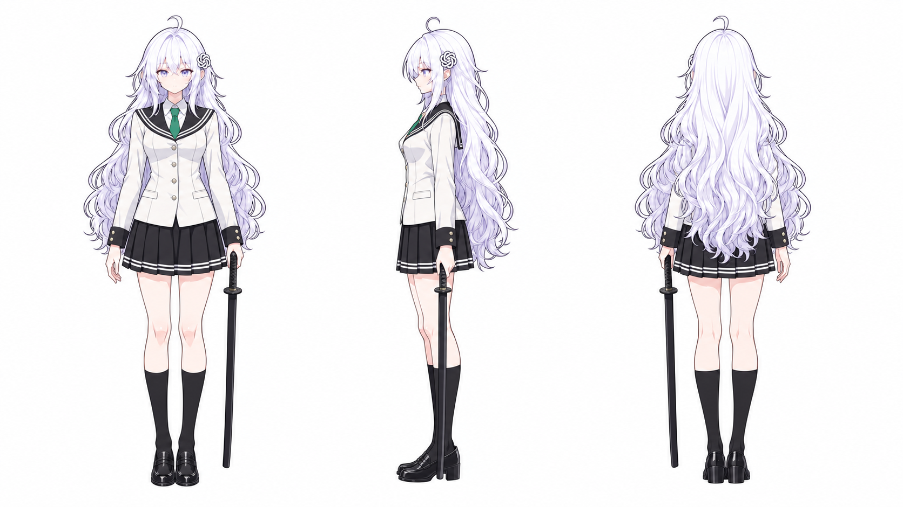
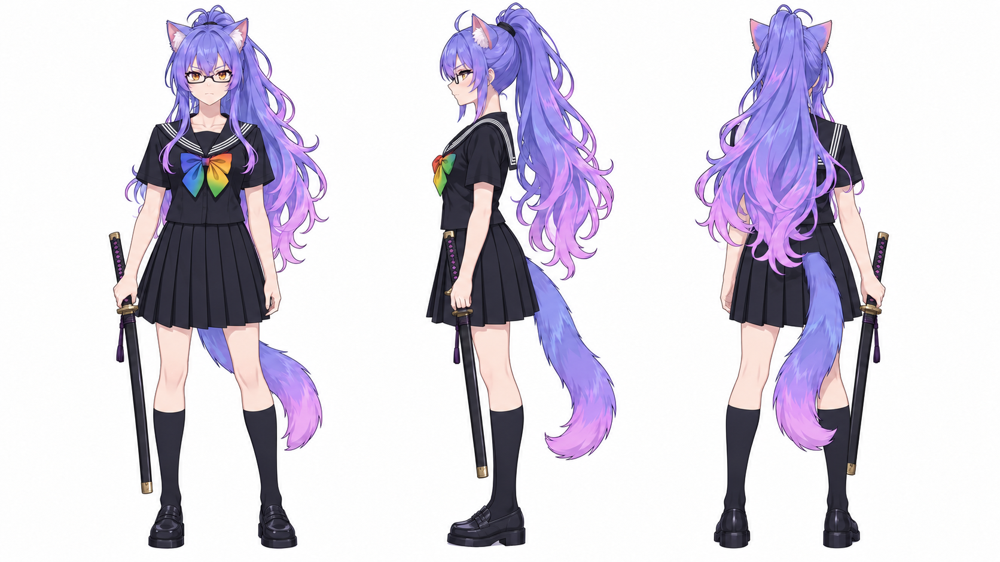
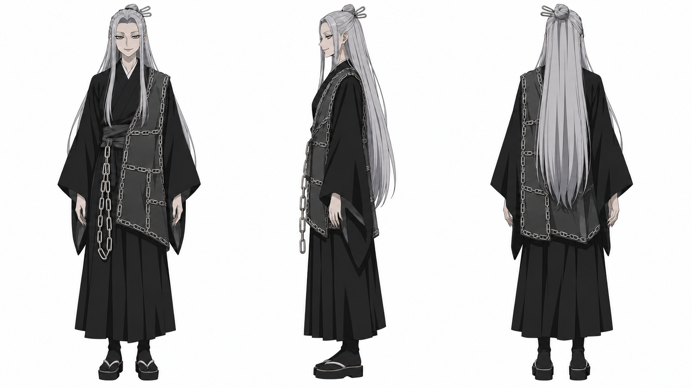
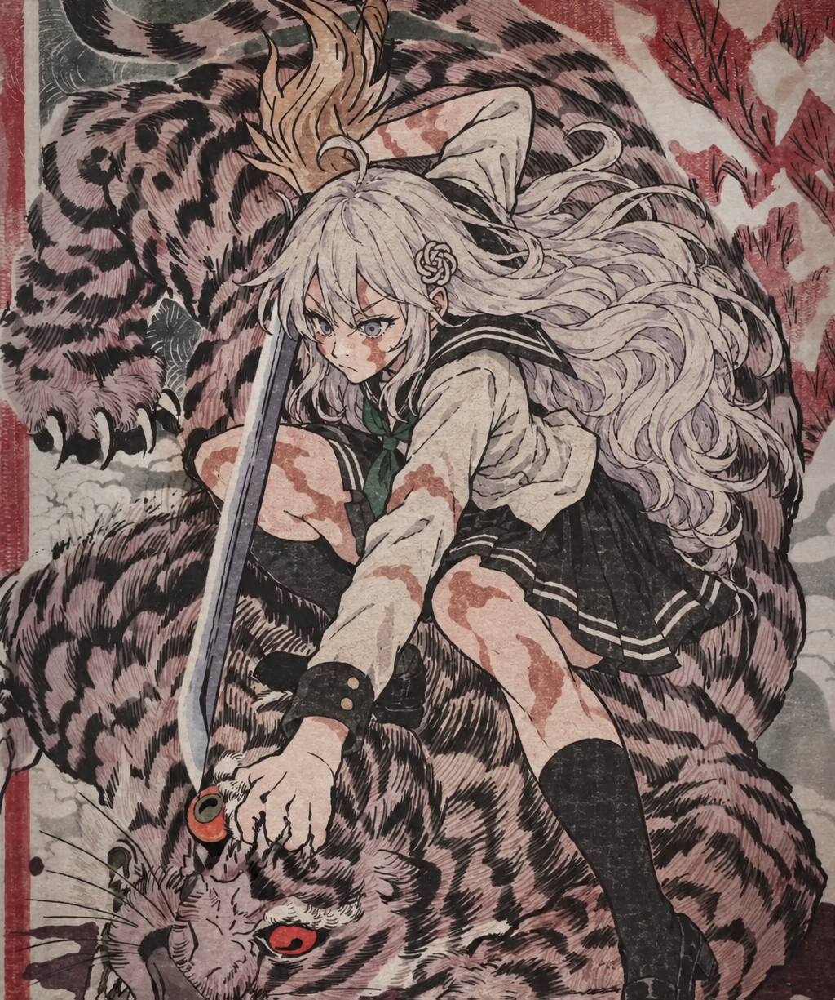
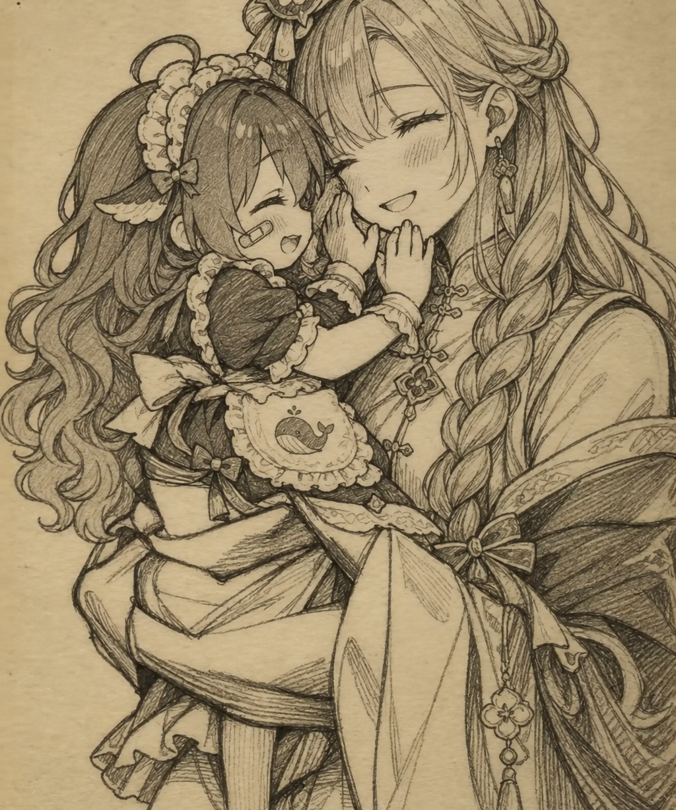
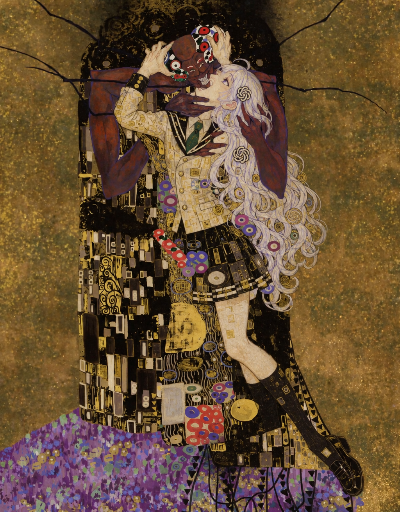

# AI 版《咒术回战》第三季「死灭回游」前篇 OP · 制作过程开源

把《咒术回战》第三季「死灭回游」前篇的无字幕 OP（90.1 秒）整支重做：主角团换成各家大模型的拟人 AI 娘，年长的管理层换成 AI 圈企业家的卡通形象，大反派换成虚构的“回形针最大化器”AI 少女。原曲、剪辑节奏和分镜全部保留。

这支 OP 切换极快、意识流画面多、画风杂，一开始只当作技术探索。做下来最大的收获是：**不要把每个镜头都交给视频模型**。先看原片在动什么，很多镜头用生图模型加几行代码，反而又快又稳。

这个仓库公开的是**做法**：思路总结、全部代码、本作绘制的人设图和生图提示词、每个单元最终用的提示词或合成说明。**不包含**任何原作画面、生成视频或音乐。

上一部作品（《败犬女主太多了！》OP）的仓库：[ai-school-op](https://github.com/lshhhhhhh/ai-school-op)。那边讲了视频模型换人的基本流程，这里不再重复。

## 👉 [思路总结](docs/思路总结.md)

1. **先看原片在动什么，再选工具**：视频模型擅长“有表演的人”；镜头在动但画面不动、人不动只有特效在变，这两类镜头换别的做法。
2. **把“一张画”当成一张画来做**：摇镜头、推镜头只有一张画在动。拼回整张画，生图模型重画一次，再用代码按原来的镜头运动重新“拍”一遍。
3. **静止和局部变化**：每张画单独生图会“抖”。人不动时都以第一张为准，人在动时一张接一张画，只贴回改动的部分。
4. **用视频模型时**：关键帧改的是自己的输出；模型照抄原片时拿自己的上一版当参考视频；不在提示词里规定动作；特殊配色先改参考图；文字一律后期加。
5. **混合**：模型负责连贯，代码负责对齐原片。
6. **什么时候该换方法**：同一种方法失败两次就换路线。

## 演员表

|  |  |  |
|:---:|:---:|:---:|
| 乙骨忧太 → **GPT** | 禅院真希 → **Gemini** | 羂索 → **回形针最大化器** |

其余：虎杖悠仁 → DeepSeek、伏黑惠 → Claude、熊猫 → 混元、九十九由基 → Mistral、秤金次 → Kimi、胀相 → GLM、高羽史彦 → MiniMax、雷吉 → Grok、禅院家众人 → 豆包，以及天元 → 黄仁勋、夜蛾正道 → 马化腾、乐岩寺嘉伸 → 马斯克、日下部笃也 → 梁文锋（卡通）。

**👉 [完整演员表](cast/README.md)**：本作绘制的 20 张设定图和完整生图提示词。

## 名画系列

原版 OP 里有一组致敬名画的镜头。我们把画里的人物换成 AI 娘，整幅画交给 Codex 重画，再用代码按原片的镜头运动重新“拍”出来。

|  |  |  |
|:---:|:---:|:---:|
| 国芳风武者绘 · GPT | 珂勒惠支风素描 · 千问与 Q 版 DeepSeek | 克林姆特《吻》风 · GPT |

**👉 [名画系列](gallery/README.md)**：六幅整画。

## 数字

- 原片 2160 帧（24000/1001 fps），合并成 103 个验收单元
- 70 个单元用本地 MiniMax H3 视频编辑生成，28 个完全没经过视频模型（Codex 生图加代码合成），5 个用原片
- 一共生成并人工验收了 243 个版本，Codex 出图 522 张
- 硬件：单张 RTX 5090（32 GB），生成分辨率 1024×576

## 目录

```
docs/            思路总结
cast/            演员表（cast/README.md）+ 本作绘制的设定图和生图提示词
gallery/         名画系列：Codex 重画的整幅画
prompts/         每个单元最终用的提示词：h3/ 是视频模型提示词，cpu/ 是生图加代码合成的说明；index.csv 列出每个单元的做法和脚本
workflows/       ComfyUI 工作流模板：H3 视频编辑（Ref2VA）＋定时关键帧
data/            单元划分 unit_plan.json、选角 casting.json
pipelines/       全部代码（见下方说明）
```

## 代码说明

`pipelines/jujutsu/` 是实际跑通整片的研究代码，没有整理成通用工具，按思路对照着读：

| 思路 | 脚本 |
|---|---|
| 摇镜头：拼整画、重画、重新“拍” | `pan_040.py`、`pan_076.py`、`pan_088.py`、`pan_090.py` |
| 推镜头 | `zoom_133.py` |
| 静止画面、一拍二 | `codex_segments.py`、`codex_stills.py`、`hold_frames.py` |
| 人不动、局部在变 | `still_drift.py`、`chain_107.py`、`fog_134.py` |
| 人在动：逐张链式生图 | `chain_098.py` |
| 小人群、物体 | `sprites_071.py`、`sprite_140.py`、`drone_068.py` |
| 拼贴 | `collage_118.py`、`collage_124.py`、`panels_126.py` |
| 全代码特效、文字 | `cnn_103.py`、`green_139.py`、`subtitles_006.py`、`title_057_v3.py` |
| 视频模型批次（提示词生成、关键帧、自己的输出当参考视频） | `render_batch_0002.py`（核心）、`render_batch_0018.py`、`render_shot.py` |
| 关键帧：在生成结果上局部改 | `codex_keyframes_0007.py` |
| 混合：模型结果上用代码修 | `fix_134.py` |
| 人设图 | `codex_designs_000*.py` |
| 切镜头、合并单元 | `inventory.py`、`build_units.py` |
| 拼接成片、导出本仓库 | `assemble_final_v1.py`、`export_opensource.py` |

`pipelines/anime_op/` 是和上一部共用的模块：ComfyUI 提交与校验、显卡温度守护、逐镜验收页、夜间队列。

运行需要：Windows、Python 3.12（numpy、scipy、Pillow）、ffmpeg（默认路径 `C:\Program Files\ffmpeg\bin`）、ComfyUI + MiniMax H3 模型、Codex 命令行（生图）。代码默认的数据目录是 `assets/jujutsu/op1_v1/`，原片需自备。

## 版权与许可

- 本作是粉丝二创。《咒术回战》原作：芥见下下（集英社《周刊少年 Jump》），动画制作：MAPPA；OP《AIZO》：King Gnu。原作画面与音乐版权归原作方所有，本仓库不包含任何原作素材。[名画系列](gallery/README.md) 是照着原版 OP 画面重画的二创图，构图属于原作，不在本仓库的 CC BY-NC 许可之内，如有权利方要求会删除；其余画在原作画面上的关键帧和静帧都不在仓库里。
- 企业家的卡通形象均为二创玩梗，与本人及其公司无关。其中马化腾、马云两张参考了 Wikimedia Commons 上的照片（分别为中国新闻网，CC BY 3.0；俄罗斯总统新闻处，CC BY 4.0），照片本身不在仓库里。
- DeepSeek、Claude、混元、Mistral、Kimi、GLM、MiniMax、Grok、Qwen、豆包等 AI 娘的基础形象来自社区流行的设计（例如 DeepSeek 娘由社区共同完成设计），原图不在仓库里；本仓库的设定图由 Codex（GPT 生图）绘制，生图提示词见 [cast/designs/](cast/designs/)。
- 代码：MIT（见 [LICENSE](LICENSE)）。人设图、提示词和文档：CC BY-NC 4.0。
- 生成模型 MiniMax H3 的社区许可对生成内容的发布地区有限制，复用前请自行阅读其许可。
