# 演员表

原作角色换成各家大模型的拟人 AI 娘；年长的管理层换成 AI 圈企业家的卡通形象，大反派换成虚构的 AI 少女。人设图只决定外观，站位、动作和镜头都跟原片走。

## 本作绘制的设定图

以下设定图由 Codex（GPT 生图）绘制，图片和完整生图提示词都在 [designs/](designs/)。生图时用到的社区原设图、原片截帧和参考照片不在仓库里。

| 设定图 | 原作角色 | 演员 | 说明 |
|---|---|---|---|
|  | 乙骨忧太 | **GPT** | 米白西装外套、黑色水手领与百褶裙、深绿色小领带，发饰是结形花饰；基于本系列原创的 GPT 娘；[提示词](designs/gpt_yuta_v6.prompt.txt) |
| 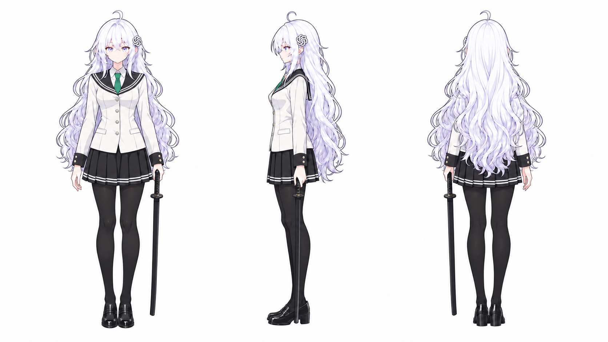 | 乙骨忧太（042） | **GPT** | 同上，只在一个仰拍镜头里加了黑色连裤袜；[提示词](designs/gpt_yuta_v6_tights.prompt.txt) |
|  | 禅院真希 | **Gemini** | 黑色水手服、Google 四色渐变领结、高马尾、眼镜、长刀；基于社区 Gemini 娘；[提示词](designs/gemini_maki_v4.prompt.txt) |
| 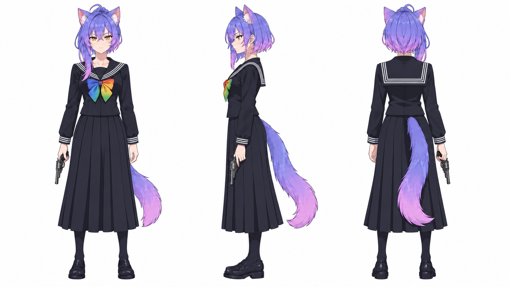 | 禅院真依（也演乌鹭亨子） | **Gemini** | 黑色水手服长袖长裙、不对称短发、左轮；基于社区 Gemini 娘；[提示词](designs/gemini_mai_v3.prompt.txt) |
|  | 羂索 | **回形针最大化器** | 原创反派 AI 少女，取自“回形针最大化器”思想实验；[提示词](designs/paperclip_maximizer_v2.prompt.txt) |
| 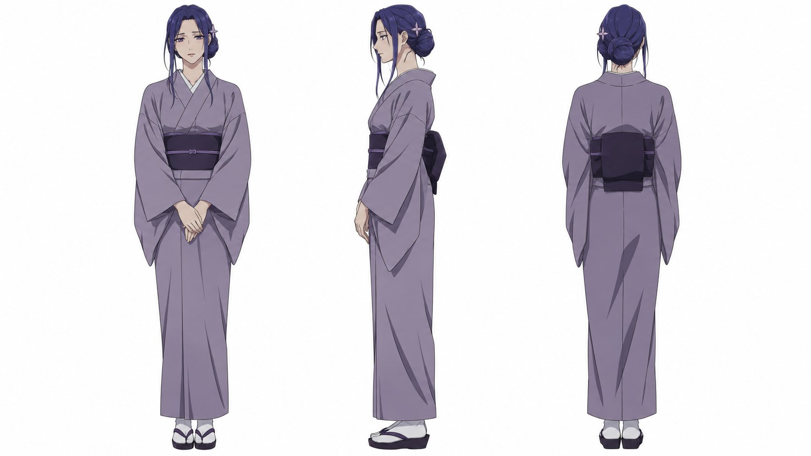 | 真希真依的母亲 | **Bard** | Gemini 的前身；[提示词](designs/bard_twins_mother_v1.prompt.txt) |
| 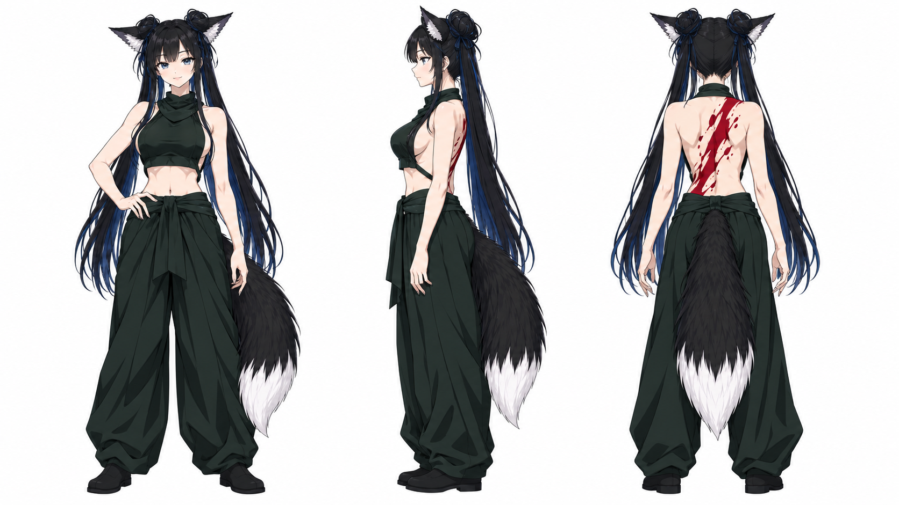 | 坏相 | **GLM 的妹妹** | 基于社区 GLM 娘；[提示词](designs/glm_eso_v1.prompt.txt) |
| 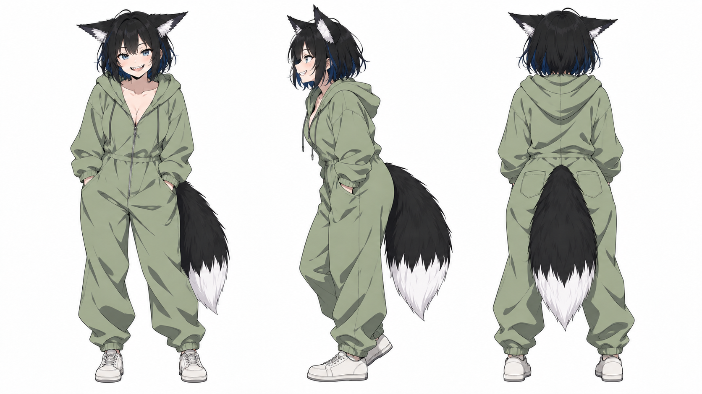 | 血涂 | **GLM 的小妹** | 基于社区 GLM 娘；[提示词](designs/glm_kechizu_v1.prompt.txt) |
| 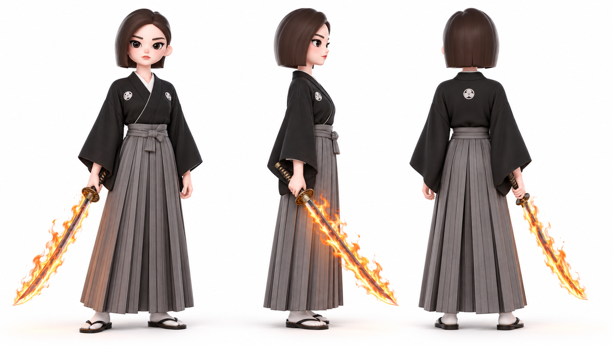 | 禅院扇 | **豆包** | 黑纹付袴、火焰刀；3D 画风，基于豆包官方头像；[提示词](designs/doubao_zenin_ogi_v1.prompt.txt) |
| 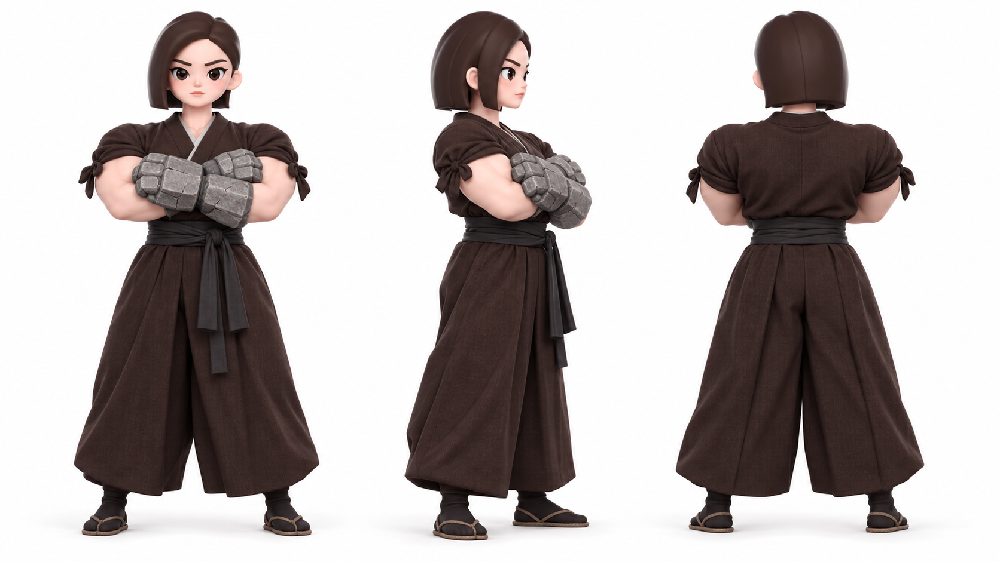 | 禅院甚壹 | **豆包** | 深色和服、巨石拳；同上；[提示词](designs/doubao_zenin_jinichi_v1.prompt.txt) |
| 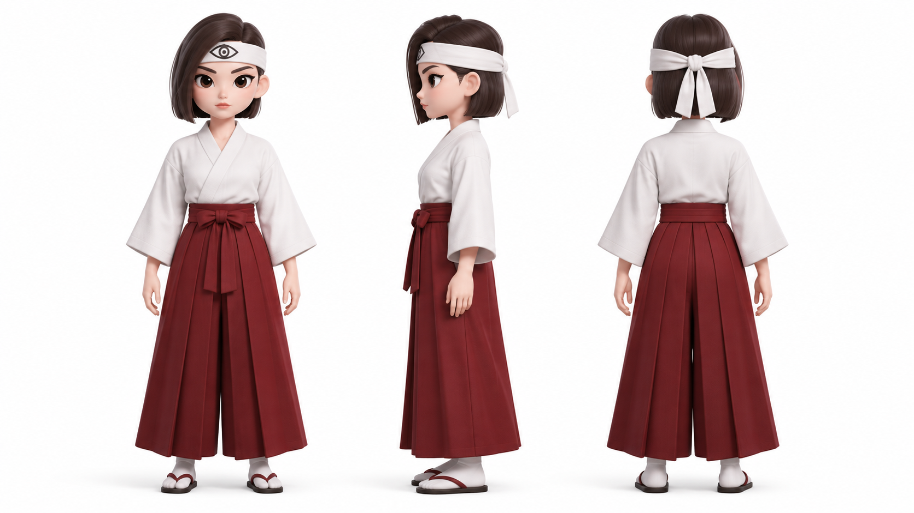 | 禅院兰太 | **豆包** | 白道服红腰带、眼纹头带；同上；[提示词](designs/doubao_zenin_ranta_v1.prompt.txt) |
| 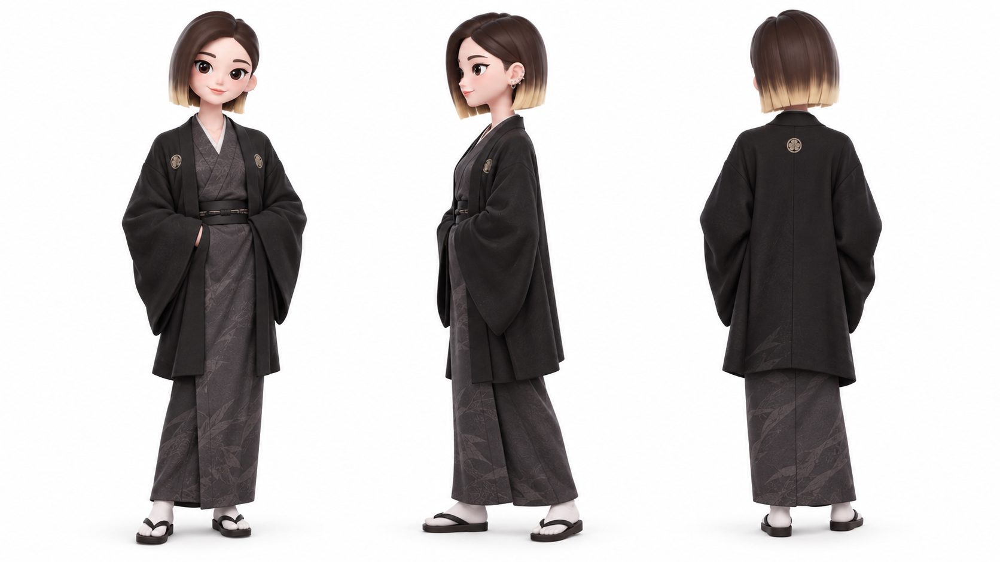 | 禅院直哉 | **豆包** | 同上；[提示词](designs/doubao_zenin_naoya_v1.prompt.txt) |
| 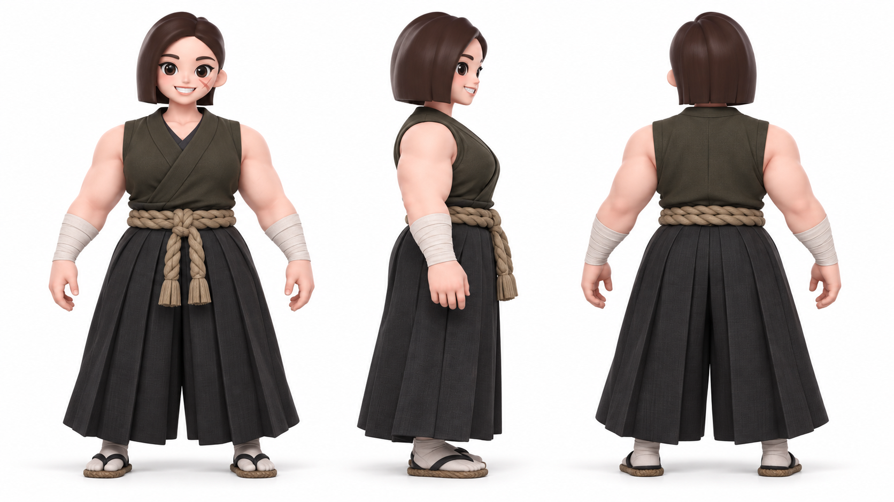 | 禅院长寿郎 | **豆包** | 同上；[提示词](designs/doubao_zenin_chojuro_v1.prompt.txt) |
| 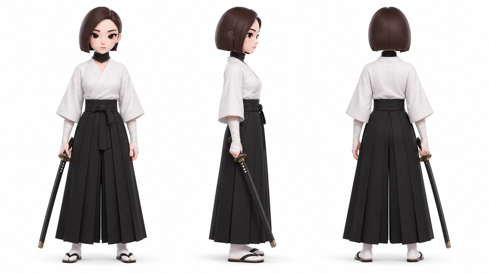 | 禅院信朗 | **豆包** | 同上；[提示词](designs/doubao_zenin_nobuaki_v1.prompt.txt) |
| 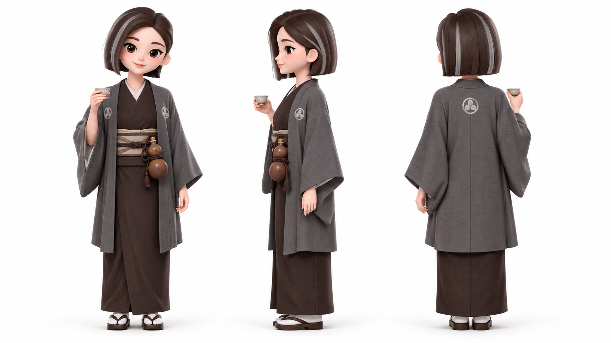 | 禅院直毘人 | **豆包** | 同上；[提示词](designs/doubao_zenin_naobito_v1.prompt.txt) |
| 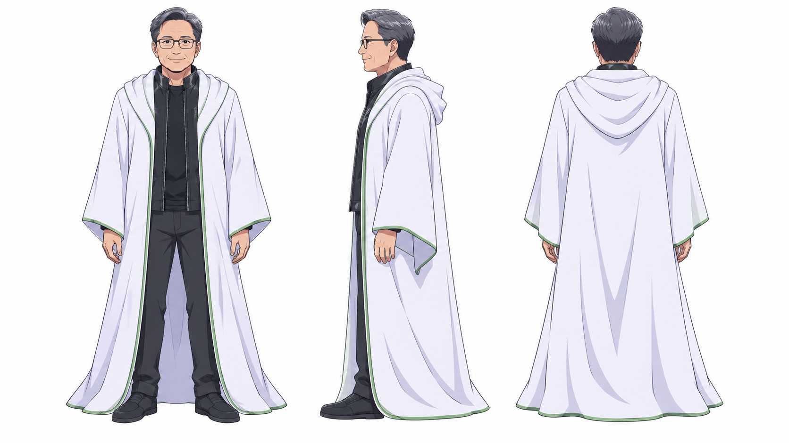 | 天元 | **黄仁勋（卡通）** | 二创卡通形象；[提示词](designs/tengen_jensen_v1.prompt.txt) |
| 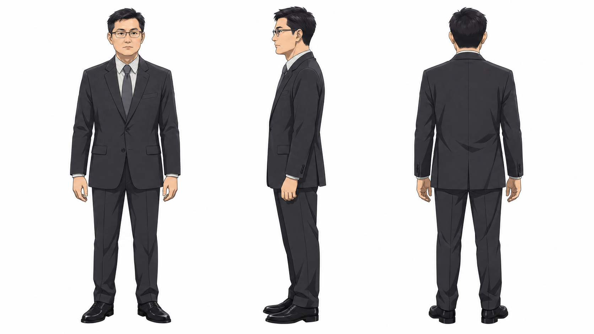 | 夜蛾正道 | **马化腾（卡通）** | 二创卡通形象；参考照片：Wikimedia Commons「马化腾 Pony Ma 2019.jpg」，中国新闻网，CC BY 3.0（照片本身不在仓库里）；[提示词](designs/ma_huateng_v3.prompt.txt) |
| 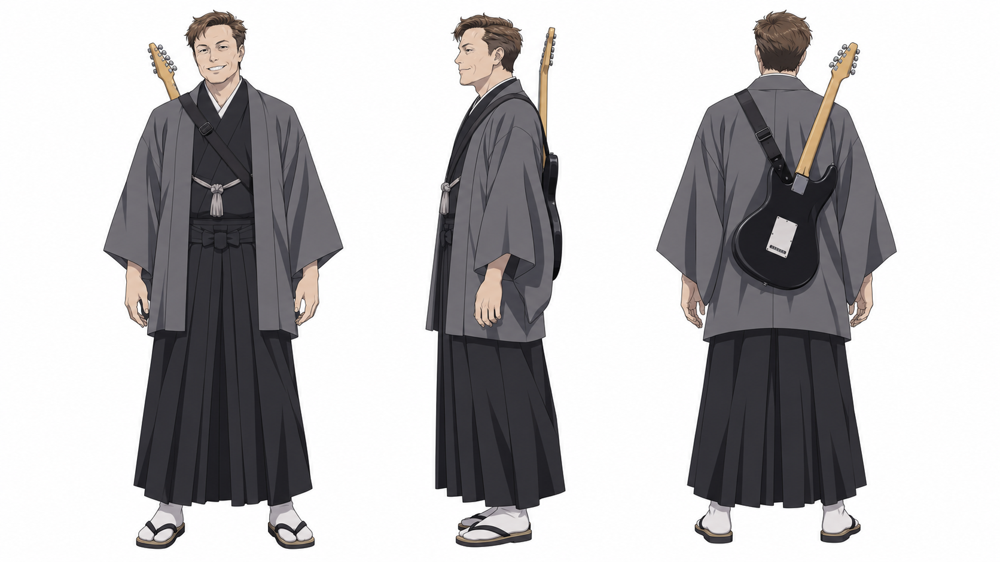 | 乐岩寺嘉伸 | **马斯克（卡通）** | 二创卡通形象；[提示词](designs/musk_gakuganji_v1.prompt.txt) |
| 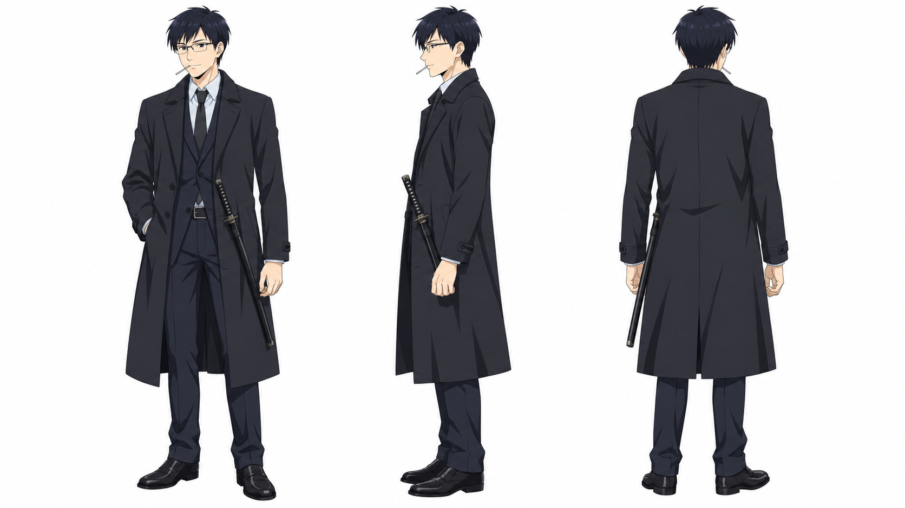 | 日下部笃也 | **梁文锋（卡通）** | 二创卡通形象；[提示词](designs/liang_kusakabe_v1.prompt.txt) |
| 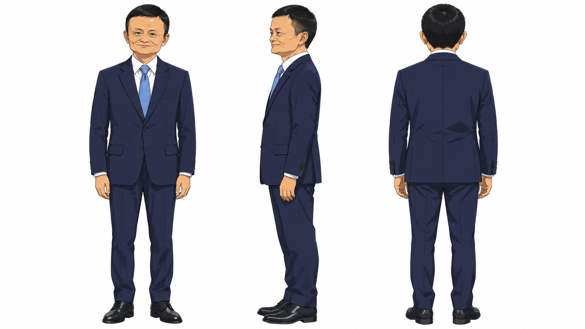 | 推轮椅的人（133） | **马云（卡通）** | 二创卡通形象；参考照片：Wikimedia Commons「Ma Yun (2017-10-19).jpg」，俄罗斯总统新闻处（kremlin.ru），CC BY 4.0（照片本身不在仓库里）；[提示词](designs/ma_yun_v1.prompt.txt) |

## 使用社区原设的角色

这些角色直接用社区流行的 AI 娘设计（例如 DeepSeek 娘由社区共同完成设计），原图不在仓库里。

| 原作角色 | 演员 |
|---|---|
| 虎杖悠仁、虎杖香织 | **DeepSeek（也有 Q 版 DeepSeek 演路人群像）** |
| 伏黑惠、日车宽见 | **Claude** |
| 熊猫 | **混元 HY** |
| 九十九由基 | **Mistral** |
| 星绮罗罗 | **Spark 讯飞星火** |
| 秤金次 | **Kimi** |
| 胀相 | **GLM** |
| 高羽史彦 | **MiniMax** |
| 雷吉·斯塔 | **Grok** |
| 石流龙、伏黑津美纪、日下部的妹妹 | **Qwen** |

企业家卡通形象均为二创玩梗，与本人及其公司无关。
