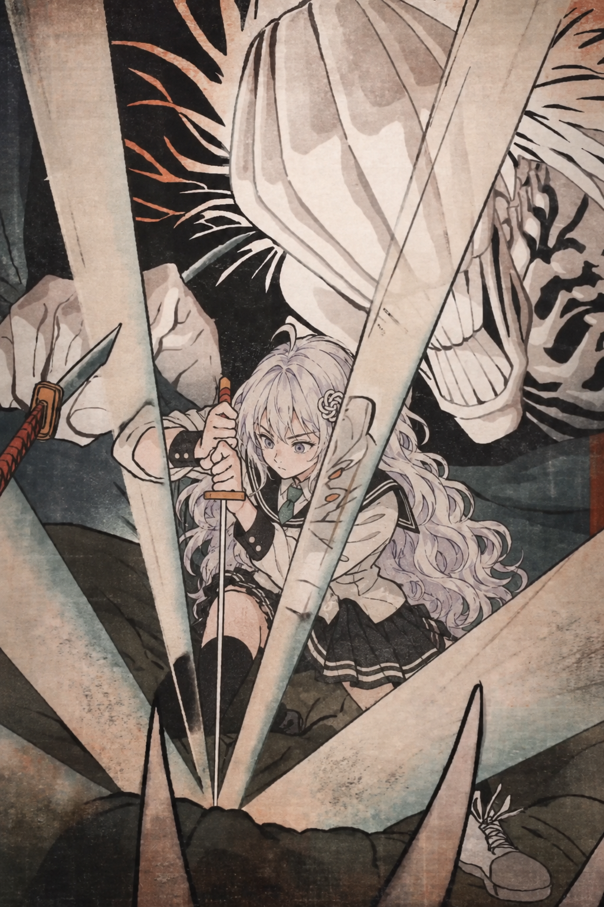
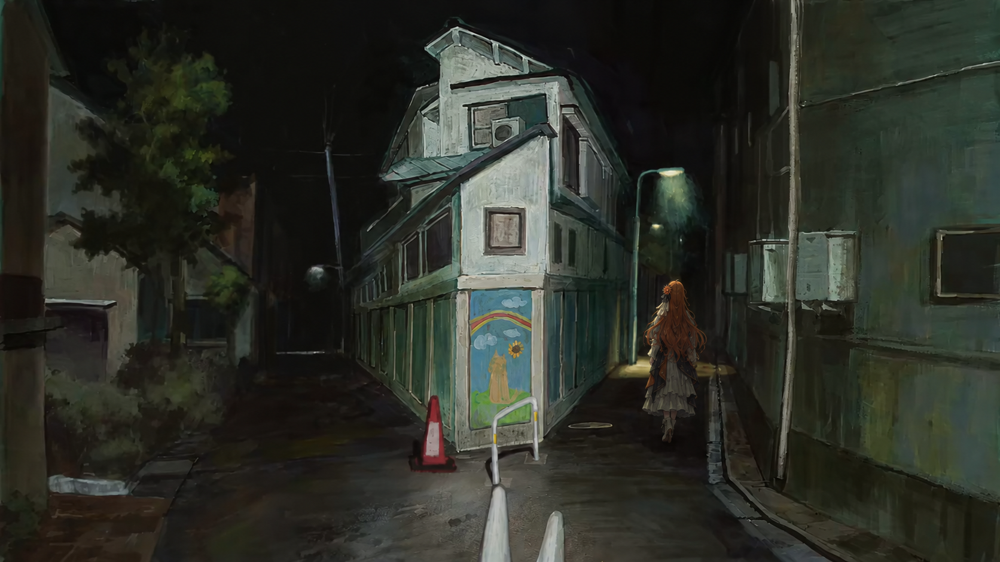

# 名画系列

原版 OP 里有一组致敬名画的镜头（浮世绘武者绘、克林姆特、珂勒惠支、横尾忠则……）。我们把画里的人物换成 AI 娘，整幅画交给 Codex（GPT 生图）重画，再用代码按原片的镜头运动重新“拍”出来，做法见[思路总结](../docs/思路总结.md)第二节。这里是 Codex 画的整幅画（摇镜头的长画已裁回实际画幅）。

这些画是照着原版 OP 的画面重画的二创图，构图属于原作，不在本仓库的 CC BY-NC 许可之内；如有权利方要求会删除。同组里的莫奈花园（075）和蒙克《呐喊》（077-080）两个镜头由视频模型 H3 生成，受其许可限制没有放在这里。

## 040 · 歌川国芳风武者绘（一）

乙骨 → GPT。原片是镜头沿着画竖直往上摇的长卷，整幅由 Codex 重画后按原轨迹重新“拍”。

## 040 · 歌川国芳风武者绘（二）

同一个镜头的后半段，镜头往下摇。

## 076 · 珂勒惠支风铅笔素描

日下部的妹妹与儿子 → 千问与 Q 版 DeepSeek，只用铅笔灰。

## 085 · 横尾忠则风夜晚 Y 字路口

伏黑惠 → Claude 的背影。

## 088 · 原创：双手合十举过头顶

原片这个镜头太难换，改成原创：DeepSeek 双手合十举过头顶，镜头从下往上摇；按成片的方式逐行重新打光（品红渐变到紫）。

## 090 · 克林姆特《吻》风

乙骨 → GPT，全身换成她的制服。

